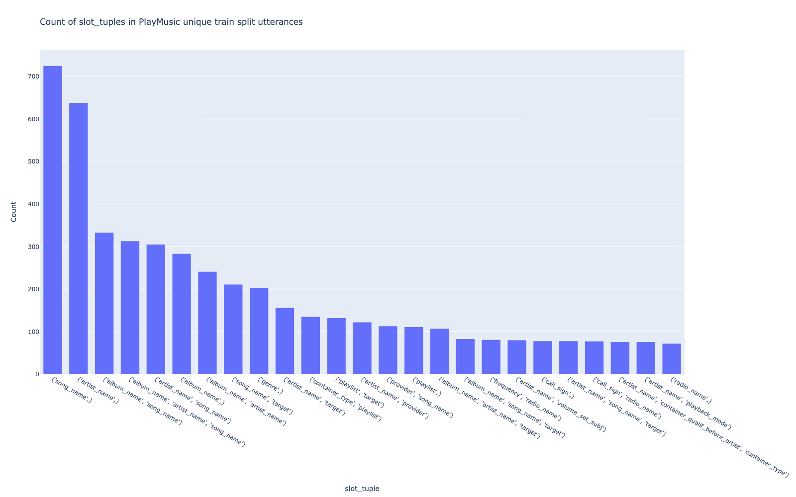
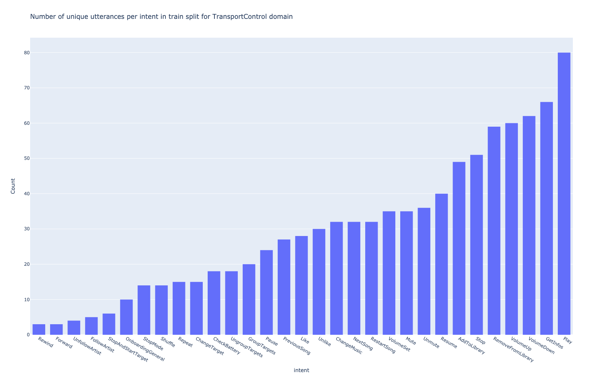
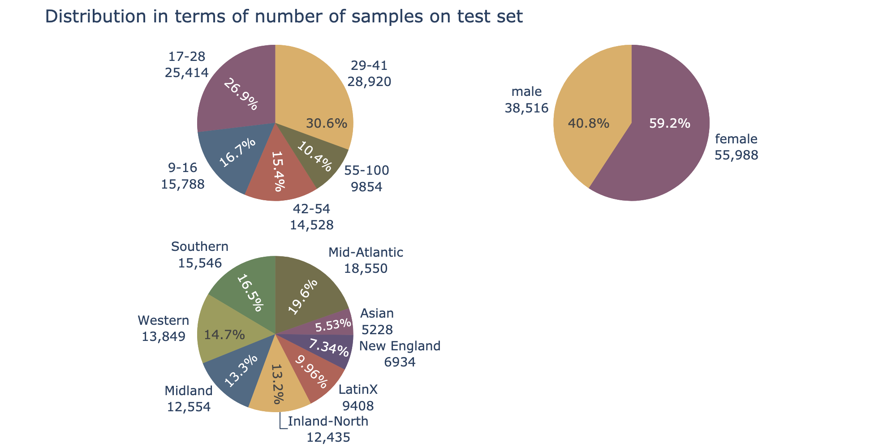
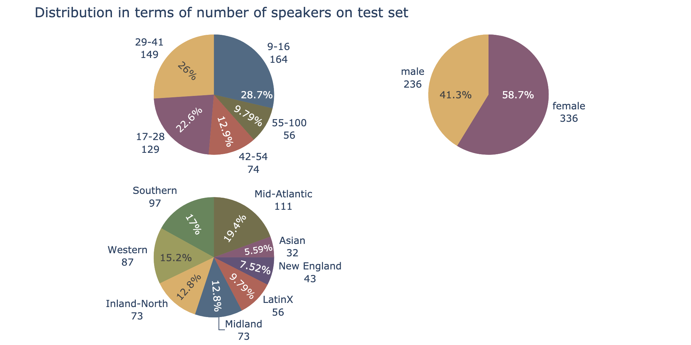
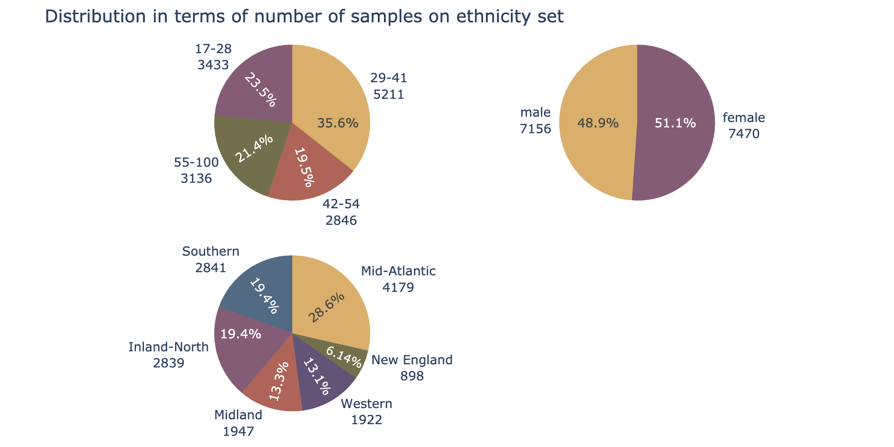
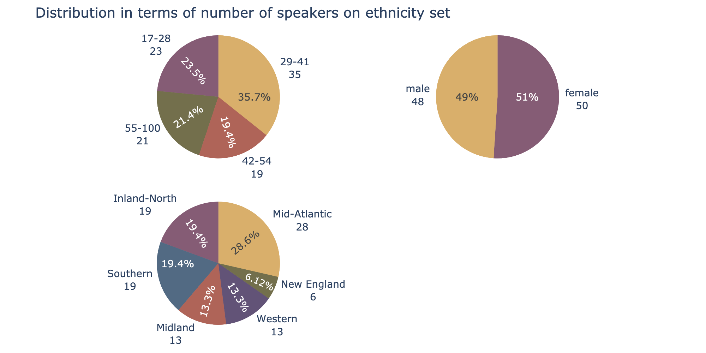

# Sonos Voice Control Bias Assessment Dataset: A Methodology for Demographic Bias Assessment in Voice Assistants

This repository contains the instructions relative to the SVC Bias Assessment Dataset and associated methodology to uncover
demographic bias in Voice Assistants. More details can be found in the following publication accepted to LREC-COLING 2024:

**Sonos Voice Control Bias Assessment Dataset: A Methodology for Demographic Bias Assessment in Voice Assistants**, LREC-COLING 2024 \
by *Chloé Sekkat, Fanny Leroy, Salima Mdhaffar, Blake Perry Smith, Yannick Estève, Joseph Dureau and Alice Coucke.*

If you use this code and/or the provided dataset in your research, please cite:

```
@inproceedings{svc-demographic-bias-assessment,
   title = {Sonos Voice Control Bias Assessment Dataset: A Methodology for Demographic Bias Assessment in Voice Assistants},
   author = {Chloé Sekkat, Fanny Leroy, Salima Mdhaffar, Blake Perry Smith, Yannick Estève, Joseph Dureau and Alice Coucke},
   journal = {Proceedings of the Conference on Language Resources and Evaluation and the In,ternational Conference on Computational Linguistics (2024)},
   month = {March},
   year = {2024}
}
```

## Content

- [Installation of the repository](#installation)
- [Dataset access & download](#dataset-access--download)
- [Repository organization](#repository-organization)
- [Dataset manipulation](#dataset-manipulation-)
- [NLU coverage: transcripts & labels](#nlu-coverage-transcripts--labels)
- [Adding ASR model decodings](#adding-new-asr-model-decodings)
- [Oracle JointBERT model](#oracle-jointbert-model-)
- [NLU evaluation](#nlu-evaluation)
- [Demographic bias assessment](#run-demographic-bias-assessment)
- [License](#license)

## Installation

The code was implemented with python 3.9. To install, create a virtual environment and add run to install requirements:

```bash
pip install -r requirements.txt
```

## Dataset access & download

In order to access the dataset, please fill the following [form](https://forms.gle/JtmFYM7xK1SaMfZYA). Upon completion,
you will be granted access shortly and will be provided with a temporary url to download it.

To ease the use of this repository, we recommend users to add the un-tared dataset in the `data` folder, under the name
`svc-dataset`.

## Repository organization

Below you can find a description of the repository organization:

```text
svc-demographic-bias-assessment
├── .gitignore                  
├── LICENSE
├── requirements.txt
├── svc_demographic_bias_assessment        # Source code, main package   
├── data
    ├── w2v_predictions
        └── all_w2v_test_predictions.json
    ├── bert_predictions
        └── all_bert_predictions.json     
    ├── plots           
    └── dataset                            # To be added after download   
├── main_confusion_bias.py
├── main_dataset_manipulation.py
├── main_demographic_bias_assessment.py
├── main_descriptive_analysis.py 
├── main_nlu_coverage.py
├── main_nlu_evaluation.py
└── README.md
```

For instance, if you add these two lines to the script:

```python
random_examples = dataset_manipulator.get_k_random_examples(k=2)
pprint(random_examples)
```

You will get 2 random examples such as:

```text
{'audio_3yQOcaylN6QCjAK5': {'audioLengthMs': 4130,
                            'content': {'domain': 'Music',
                                        'subdomain': 'TransportControl'},
                            'speaker': {'age': '66',
                                        'age_group': '55-100',
                                        'dialectal_region': 'USA Mid-Atlantic',
                                        'ethnicity': None,
                                        'gender': 'male',
                                        'user_group': '6',
                                        'user_id': '28081'},
                            'transcript': {'label': {'intent': 'VolumeDown',
                                                     'slots': [{'entity': {'name': 'container_type_ent'},
                                                                'name': 'container_type',
                                                                'range': {'end': 28,
                                                                          'start': 23},
                                                                'value': {'normalized_slot_value': 'radio',
                                                                          'slot_value': 'radio'}},
                                                               {'entity': {'name': 'volume_shift_subj_ent'},
                                                                'name': 'volume_shift_subj',
                                                                'range': {'end': 46,
                                                                          'start': 34},
                                                                'value': {'normalized_slot_value': 'a '
                                                                                                   'few '
                                                                                                   'levels',
                                                                          'slot_value': 'a '
                                                                                        'few '
                                                                                        'levels'}}]},
                                           'normalized_text': 'turn the volume '
                                                              'of the radio '
                                                              'down a few '
                                                              'levels',
                                           'text': 'turn the volume of the '
                                                   'radio down a few levels'}},
 'audio_5QH6UPITaQKhrCPj': {'audioLengthMs': 2399,
                            'content': {'domain': 'Music',
                                        'subdomain': 'TransportControl'},
                            'speaker': {'age': '23',
                                        'age_group': '17-28',
                                        'dialectal_region': 'USA Mid-Atlantic',
                                        'ethnicity': None,
                                        'gender': 'female',
                                        'user_group': '6',
                                        'user_id': '21004'},
                            'transcript': {'label': {'intent': 'Mute',
                                                     'slots': []},
                                           'normalized_text': 'volume off',
                                           'text': 'volume off'}}}
```

## Dataset manipulation 

To manipulate the SVC Bias Assessment Dataset, we created a python class `DatasetManipulator` that can be accessed through
the `main_dataset_manipulation.py` script. The `DatasetManipulator` contains several methods that one can play with to get
information on the released dataset.

```
All available methods are:

[
    'display_transcript_by_audio_id',
    'get_all_audio_ids_associated_to_given_intent',
    'get_all_transcripts_associated_to_given_intent',
    'get_k_random_examples',
    'get_list_of_intents_in_dataset',
    'get_music_entities_coverage',
    'get_number_of_audios',
    'get_number_of_audios_per_intent_type',
    'get_number_of_hours',
    'get_number_of_hours_per_intent_type',
    'get_number_of_unique_speakers',
    'get_number_of_unique_transcripts',
    'get_number_of_unique_transcripts_per_intent_type',
    'get_slot_name_coverage',
    'play_audio_file_by_audio_id',
    'play_audio_files_speaker_id'
 ]
```

## NLU coverage: transcripts & labels

To get an overview of the NLU coverage provided in the release dataset, you can run the following command:

```bash
python3 main_nlu_coverage.py \
  --train_metadata_filepath ./data/svc_dataset/metadata/train_metadata.json \
  --save_data_directory ./data
```

Note that all results given by this script use only the unique number of utterance (i.e. all duplicates are removed). This
makes it easier to account for the large variety of music entities the released dataset provide.

Below is the count of `slot_tuples` among the unique utterances in the train split for PlayMusic. We can see that there
are 725 unique utterances containing only a `song_name` as slot while 333 contain both `album_name` and `artist_name`.


Here is the number of unique utterances per intent in the train split for TransportControl domain. For intsnace, there
are 80 unique utterances (i.e. different utterances) that belong to the `Play` intent.



## Adding new ASR model decodings

Once you've chosen an ASR model and run the inference for each audio in the test set, you can save the predictions in 
the following format:

```json
{
  "audio_id": "prediction"
}
```

You can refer to the examples given in `data/w2v_predictions/all_w2v_test_predictions.json`.

## Oracle JointBERT model 

You can use any implementation of the [JointBERT](https://arxiv.org/abs/1902.10909) model and fine-tune it on the training set
of the proposed dataset (i.e. on all normalized queries, `normalized_text` field).

Once the model has been trained, it can be run on the ASR predictions for each audio in the test set. The model we used
led to the NLU predictions saved at `data/bert_predictions/all_bert_predictions.json`. 

## NLU evaluation

Once the previous steps have been done, we can perform the NLU evaluation, giving for each utterance the associated
Exact Match metric.

```bash
python3 main_nlu_evaluation.py \
  --bert_predictions_filepath ./data/bert_predictions/all_bert_predictions.json \
  --test_metadata_filepath ./data/svc_dataset/metadata/test_metadata.json \
  --save_data_directory ./data/bert_predictions
```

This script will create the following file `metadata_test_with_bert_predictions.json` contains both the original metadata
and the SLU predictions.

## Run demographic bias assessment

This is the core of this repository. 

### Descriptive analysis

This script allows to generate several descriptive statistics and figures provided in the paper.

```bash
python3 main_descriptive_analysis.py \
  --set_ test \
  --metadata_filepath ./data/svc_dataset/metadata/test_metadata.json  \
  --save_data_directory ./data \
  --save_figures 
```

This command given above will lead to the following figures:







### Confusion bias

This script allows to generate the confusion bias tables provided in the paper.

```bash
python3 main_confusion_bias.py \
  --set_ test \
  --metadata_filepath ./data/svc_dataset/metadata/test_metadata.json \
  --save_data_directory ./data
```

For instance, with the command given above, you'll get, amongst others, the percentage of audio samples by gender per
dialectal region for the test split:

```markdown
Distribution of gender per dialectal region:
+----------------------------+------------+--------------+
|                            |   audio_id |   percentage |
|----------------------------+------------+--------------|
| ('Asian', 'female')        |       3229 |           62 |
| ('Asian', 'male')          |       1999 |           38 |
| ('Inland-North', 'female') |       6468 |           52 |
| ('Inland-North', 'male')   |       5967 |           48 |
| ('LatinX', 'female')       |       6169 |           66 |
| ('LatinX', 'male')         |       3239 |           34 |
| ('Mid-Atlantic', 'female') |      10537 |           57 |
| ('Mid-Atlantic', 'male')   |       8013 |           43 |
| ('Midland', 'female')      |       7927 |           63 |
| ('Midland', 'male')        |       4627 |           37 |
| ('New England', 'female')  |       4647 |           67 |
| ('New England', 'male')    |       2287 |           33 |
| ('Southern', 'female')     |       8495 |           55 |
| ('Southern', 'male')       |       7051 |           45 |
| ('Western', 'female')      |       8516 |           61 |
| ('Western', 'male')        |       5333 |           39 |
+----------------------------+------------+--------------+
```

### Statistical testing

This script is the core of the statistical methodology provided in the paper.

```bash
python3 main_demographic_bias_assessment.py \
  --asr_predictions_filepath ./data/bert_predictions/metadata_test_with_bert_predictions.json \
  --save_data_directory ./data \
  --group_usa_dialectal_regions False
```

Results show statistically significant differences in performance across age, dialectal region and ethnicity.
Below is an example of the analysis of some of the performed tests:

#### Univariate logistic regression for gender

The output of this univariate test is the following:

```markdown
Univariate log reg for gender is statistically significant at the 5% level

Logistic regression pvalues:
Intercept            0.000000
C(gender)[T.male]    0.016558

                           Logit Regression Results                           
==============================================================================
Dep. Variable:          exactlyParsed   No. Observations:                94504
Model:                          Logit   Df Residuals:                    94502
Method:                           MLE   Df Model:                            1
Date:                Tue, 05 Mar 2024   Pseudo R-squ.:               8.941e-05
Time:                        16:56:57   Log-Likelihood:                -32198.
converged:                       True   LL-Null:                       -32201.
Covariance Type:            nonrobust   LLR p-value:                   0.01641
=====================================================================================
                        coef    std err          z      P>|z|      [0.025      0.975]
-------------------------------------------------------------------------------------
Intercept             2.0984      0.014    154.891      0.000       2.072       2.125
C(gender)[T.male]     0.0515      0.021      2.396      0.017       0.009       0.094
=====================================================================================
------------------------------------------------
Odd ratios:
                         OR  Lower CI  Upper CI
Intercept          8.152853  7.939224  8.372229
C(gender)[T.male]  1.052819  1.009418  1.098086
------------------------------------------------
------------------------------------------------
```

You can see that men are significantly better recognized than women since the pvalue is equal to $0.017$ (i.e. the test is
statistically significant at the 5% level) and the odd ratio is equal to $1.05$ (i.e. men have 1.05 times more chance to be better
recognized than women). 

#### Univariate logistic regression for dialectal region

```markdown
Univariate log reg for dialectal_region is statistically significant at the 5% level

Logistic regression pvalues:
Intercept                              7.440429e-298
C(dialectal_region)[T.Inland-North]    2.410951e-158
C(dialectal_region)[T.LatinX]           6.799730e-04
C(dialectal_region)[T.Mid-Atlantic]    6.663805e-162
C(dialectal_region)[T.Midland]         7.670283e-127
C(dialectal_region)[T.New England]      1.380474e-89
C(dialectal_region)[T.Southern]        1.065570e-142
C(dialectal_region)[T.Western]         6.905810e-137

                           Logit Regression Results                           
==============================================================================
Dep. Variable:          exactlyParsed   No. Observations:                94504
Model:                          Logit   Df Residuals:                    94496
Method:                           MLE   Df Model:                            7
Date:                Tue, 05 Mar 2024   Pseudo R-squ.:                 0.02724
Time:                        16:56:58   Log-Likelihood:                -31324.
converged:                       True   LL-Null:                       -32201.
Covariance Type:            nonrobust   LLR p-value:                     0.000
=======================================================================================================
                                          coef    std err          z      P>|z|      [0.025      0.975]
-------------------------------------------------------------------------------------------------------
Intercept                               1.2142      0.033     36.887      0.000       1.150       1.279
C(dialectal_region)[T.Inland-North]     1.2589      0.047     26.811      0.000       1.167       1.351
C(dialectal_region)[T.LatinX]           0.1416      0.042      3.398      0.001       0.060       0.223
C(dialectal_region)[T.Mid-Atlantic]     1.1386      0.042     27.114      0.000       1.056       1.221
C(dialectal_region)[T.Midland]          1.0829      0.045     23.958      0.000       0.994       1.171
C(dialectal_region)[T.New England]      1.0597      0.053     20.069      0.000       0.956       1.163
C(dialectal_region)[T.Southern]         1.0995      0.043     25.434      0.000       1.015       1.184
C(dialectal_region)[T.Western]          1.1051      0.044     24.903      0.000       1.018       1.192
=======================================================================================================
------------------------------------------------
Odd ratios:
                                           OR  Lower CI  Upper CI
Intercept                            3.367586  3.157185  3.592008
C(dialectal_region)[T.Inland-North]  3.521621  3.211988  3.861101
C(dialectal_region)[T.LatinX]        1.152062  1.061724  1.250087
C(dialectal_region)[T.Mid-Atlantic]  3.122292  2.875614  3.390132
C(dialectal_region)[T.Midland]       2.953176  2.702809  3.226735
C(dialectal_region)[T.New England]   2.885496  2.601804  3.200122
C(dialectal_region)[T.Southern]      3.002811  2.758856  3.268338
C(dialectal_region)[T.Western]       3.019537  2.768006  3.293924
------------------------------------------------
```

In this case, every group is better recognized than the Asian reference group. However, while requests from all American
regional groups have around 3 times more chance to be exactly parsed than Asians' (ORs are around $3$, all p-values are 
$<1e-89$), this is only just slightly the case for the LatinX group ($OR=1.15$).

#### Multivariate analysis

This step is crucial to shine light on possible mixed effects. Below is the raw output from our script:

```markdown
INFO:__main__:Performing adjustment tests

Adjustment test with age_group, gender:
Test is statistically significant. But conclusions about age_group are unchanged at the 5% level therefore gender is NOT a confounding factor for age_group.
Test is statistically significant. But conclusions about gender are unchanged at the 5% level therefore age_group is NOT a confounding factor for gender.

Adjustment test with age_group, dialectal_region:
Test is statistically significant. But conclusions about age_group are unchanged at the 5% level therefore dialectal_region is NOT a confounding factor for age_group.
Test is statistically significant. But conclusions about dialectal_region are unchanged at the 5% level therefore age_group is NOT a confounding factor for dialectal_region.

Adjustment test with age_group, ethnicity:
Test is statistically significant. But conclusions about age_group are unchanged at the 5% level therefore ethnicity is NOT a confounding factor for age_group.
age_group is NOT a confounding factor for ethnicity at the 5% level

Adjustment test with gender, dialectal_region:
Test is statistically significant. dialectal_region is a confounding factor for gender. Conclusions about gender are changed at the 5% level
gender is NOT a confounding factor for dialectal_region at the 5% level

Adjustment test with gender, ethnicity:
Test is statistically significant. But conclusions about gender are unchanged at the 5% level therefore ethnicity is NOT a confounding factor for gender.
gender is NOT a confounding factor for ethnicity at the 5% level

Adjustment test with dialectal_region, ethnicity:
Test is statistically significant. But conclusions about dialectal_region are unchanged at the 5% level therefore ethnicity is NOT a confounding factor for dialectal_region.
dialectal_region is NOT a confounding factor for ethnicity at the 5% level
```

To get more detail results, we encourage you to look deeper in the code to better grasp the logic and the complete computations.

**TL;DR:**
- dialectal region is a confounding factor for gender
- there is a cross-effect of age and dialectal region

## License

This repository and the SVC Bias Assessment Dataset are under the following [LICENSE](https://github.com/sonos/svc-demographic-bias-assessment/blob/main/LICENSE). 
They can be used only for academic and/or research purposes, not for commercial use. Publication is permitted only if 
the dataset is unmodified and subject to the same license terms. Any publication must include a full citation of the paper:

```text
Sekkat C. et al., 2024, "Sonos Voice Control Bias Assessment Dataset: A Methodology for Demographic Bias Assessment in Voice Assistants"
```
